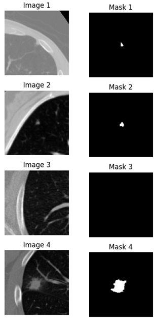
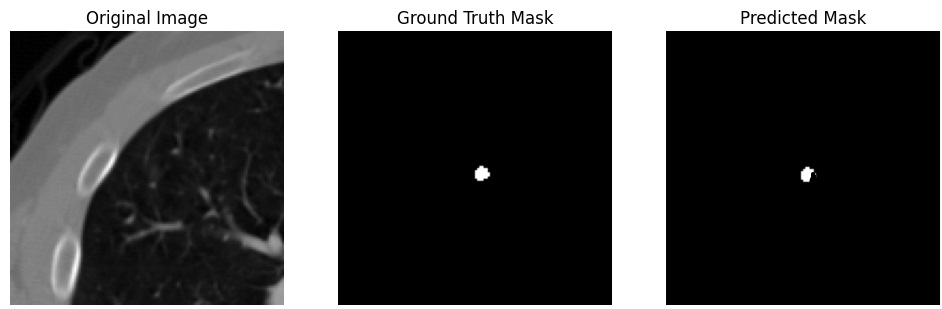

## Introduction
This is a PyTorch implementation of the U-Net model and SWIN Trasnformer for lung nodules segmentation in CT images. The model is trained on the LIDC-IDRI dataset.  The model is trained using the Dice loss function. 

## Literature
- [U-Net: Convolutional Networks for Biomedical Image Segmentation](https://arxiv.org/abs/1505.04597) 
- [SWIN Transformer: Hierarchical Vision Transformer using Shifted Windows](https://arxiv.org/abs/2103.14030)

## Dataset
The LIDC-IDRI dataset is used for training and validation. The dataset can be downloaded from the [LIDC-IDRI website]([https://wiki.cancerimagingarchive.net/display/Public/LIDC-IDRI](https://wiki.cancerimagingarchive.net/pages/viewpage.action?pageId=1966254)). The dataset contains 1018 CT scans with annotations of lung nodules. The dataset is divided into 3 subsets: training, validation and test. The test subset is used to run inference.

  

## Preprocessing
The CT images are preprocessed by resizing the images to 256x256 pixels and normalizing the pixel values to the range [0, 1]. Augmentation techniques such as rotation, flipping, and scaling are used to increase the size of the training dataset.

## Training for UNET model

The model is trained using the following hyperparameters:
- Batch size: 16
- Learning rate: 0.001
- Number of epochs: 25
- Optimizer: Adam

| Epoch | Loss   | Val Loss  | Dice WT  | Dice TC  | Dice ET | Mean Dice |
|-------|--------|----------|----------|----------|----------|------------|
| ...   | ...    | ...      | ...      | ...      | ...      | ...        |
| 23    | 0.0434 | 1.5953   | 0.3423   | 0.4483   | 0.3390   | 0.4458     |
| 24    | 0.0426 | 1.7978   | 0.3460   | 0.4520   | 0.3547   | 0.4622     |
| 25    | 0.0419 | 0.9788   | 0.3477   | 0.4545   | 0.3723   | 0.4776     |
| 26    | 0.0413 | 0.5277   | 0.3495   | 0.4568   | 0.3385   | 0.4428     |

Example segmentation inference results of the U-Net model:

## Training for SWIN Transformer model
TIMM is used to load the SWIN Transformer model. The model is trained using the following hyperparameters:
- Batch size: 16
- Learning rate: 0.0001
- Number of epochs: 100
- Optimizer: Adam

## Conclusion
The U-Net model and SWIN Transformer model are trained on the LIDC-IDRI dataset for lung nodules segmentation. The models achieve a mean Dice score of 0.4776 and 0.3823, respectively. 
There need to be changes to the model loss function and the model architecture to improve the model performance.
